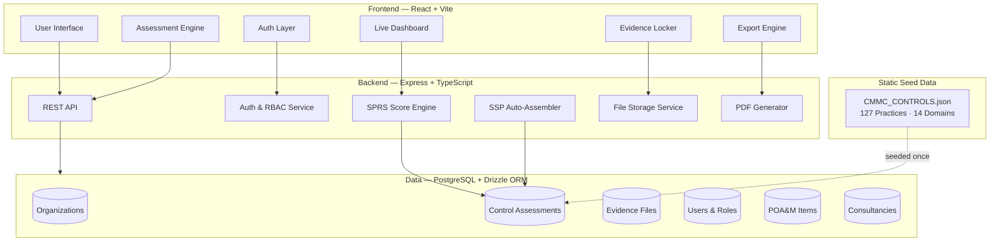
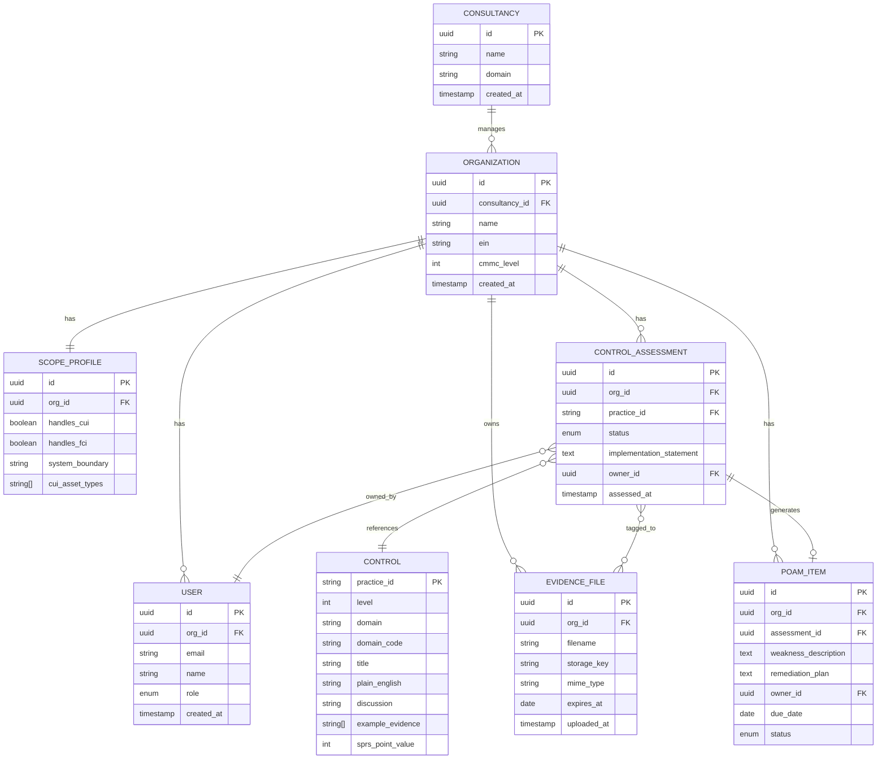
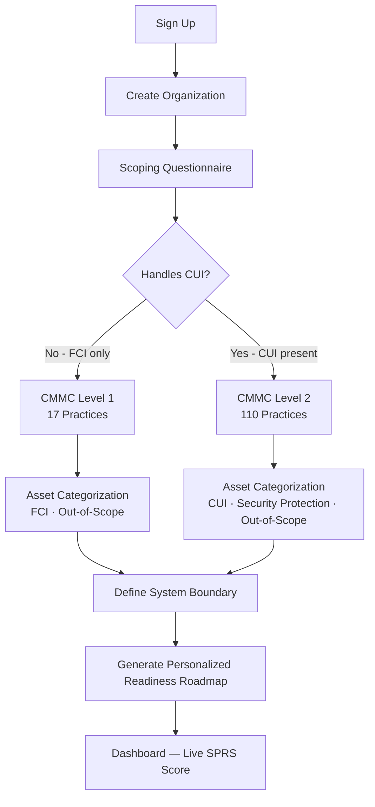
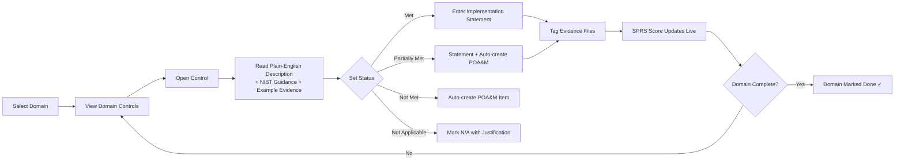
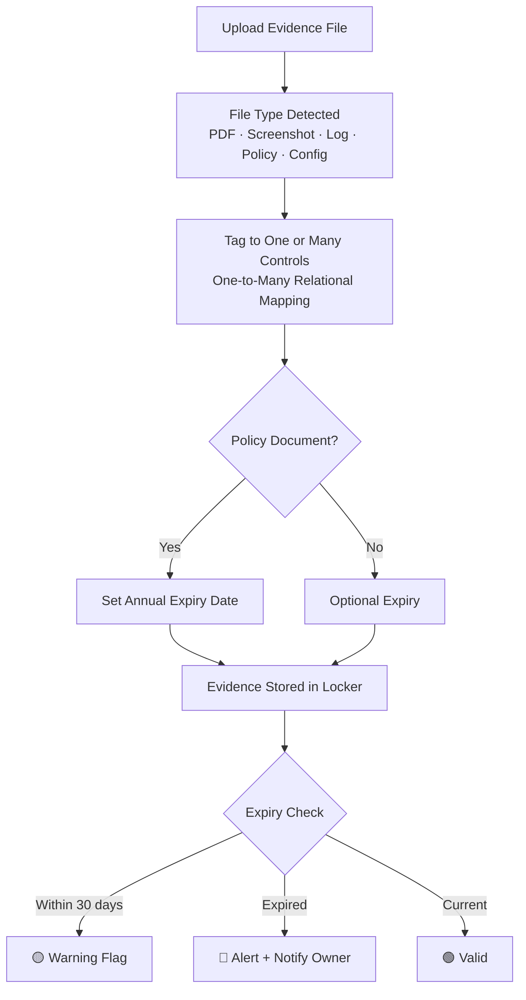
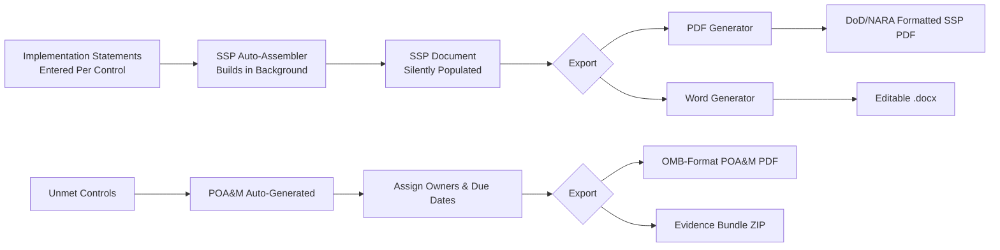
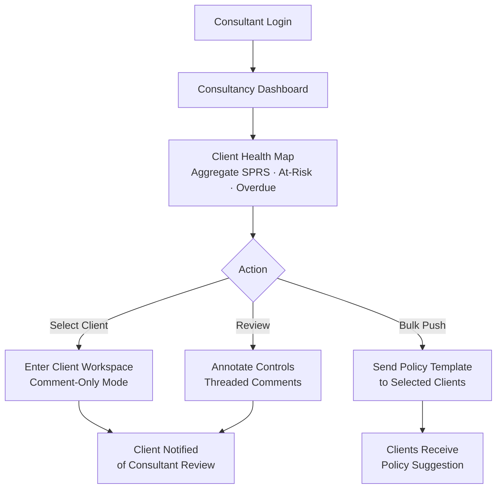

<div align="center">
  

  <h1>CMMC Compass</h1>
  <p><strong>GRC Guidance &nbsp;·&nbsp; Clarity &nbsp;·&nbsp; Secure Progress</strong></p>

  [](LICENSE)
  [](https://www.acq.osd.mil/cmmc/)
  [](CONTRIBUTING.md)
  []()
</div>

---

> CMMC Compass turns a 110-control federal cybersecurity framework into a guided, intuitive, and satisfying compliance journey — from first login to assessment-ready. Built for defense contractors and the consultancies that support them.

---

## Table of Contents

- [Overview](#overview)
- [Who It Is For](#who-it-is-for)
- [Features](#features)
- [Architecture](#architecture)
- [Data Model](#data-model)
- [User Flows](#user-flows)
- [CMMC Framework Coverage](#cmmc-framework-coverage)
- [Tech Stack](#tech-stack)
- [Project Structure](#project-structure)
- [Roadmap](#roadmap)
- [Getting Started](#getting-started)
- [Contributing](#contributing)
- [License](#license)

---

## Overview

The Cybersecurity Maturity Model Certification (CMMC) is a Department of Defense framework requiring defense contractors to demonstrate cybersecurity compliance before and during contract performance. The audit process involves 14 domains, up to 110 controls, a formally assessed SPRS score, a System Security Plan (SSP), and a Plan of Action & Milestones (POA&M) — all of which must be maintained, evidenced, and exportable on demand.

Most contractors experience **compliance fatigue** before they ever reach an assessor. CMMC Compass eliminates that by making the process feel manageable, measurable, and even rewarding.

**Three core principles drive every design decision:**

| Principle | What it means |
|---|---|
| **Clarity** | Every control is explained in plain English. No jargon without translation. |
| **Guidance** | Every screen answers: *"What do I do next?"* Progress is always visible. |
| **Progress** | Your SPRS score is live, visible, and always climbing. Compliance becomes a metric, not a mystery. |

---

## Who It Is For

| Track | Audience | Purpose |
|---|---|---|
| **Track 1** | Defense Contractors | Self-assessment, evidence management, SSP/POA&M generation |
| **Track 3** | Consultancies / MSPs / MSSPs | Multi-client management, policy templates, aggregate health views |

> Track 2 (C3PAO Assessor tooling) is planned for a future phase.

---

## Features

### Track 1 — Contractor Compliance Platform

- **Smart Scoping Engine** — A logic-driven questionnaire that auto-determines CMMC Level 1 (FCI only) or Level 2 (CUI) applicability and defines your assessment boundary (ADE). Categorizes CUI Assets, Security Protection Assets, and Out-of-Scope Assets.
- **Domain-by-Domain Guided Assessment** — Walk all 14 domains at a human pace. Each control includes a plain-English summary, NIST discussion, and example evidence types.
- **Live SPRS Score** — Supplier Performance Risk System score updates in real time. Starts at 110 and deducts points per unimplemented control (1, 3, or 5 points). Always visible. Always accurate.
- **Golden Path Widget** — Surfaces the 3 controls that will gain you the most SPRS points right now. Creates an actionable remediation path, not just a list.
- **Evidence Locker** — Upload once, map to many controls. One Access Control Policy can satisfy 10+ requirements — the system models this correctly with a many-to-many relationship. Evidence expiry flagging keeps your package audit-ready year-round.
- **POA&M Tracker** — Automatically generated from all non-met controls. Assign owners, set due dates, track remediation status, and export in OMB-compliant format.
- **SSP Auto-Assembly** — As you enter implementation statements for each control, the System Security Plan silently assembles in the background. No last-minute scrambling before an assessment.
- **One-Click Export** — Professionally formatted PDF exports of SSP and POA&M following DoD/NARA templates. Evidence bundles export as a structured ZIP package.
- **Assessor View Toggle** — Simulate what a C3PAO sees: Control ID + Implementation Statement + Tagged Evidence + Responsible Owner. Find gaps before the assessment does.

### Track 3 — Consultancy / MSP Layer

- **Multi-Tenant Architecture** — Manage unlimited client organizations from a single consultancy account. Each client operates in their own isolated workspace.
- **Client Health Map** — Aggregate view of every client's SPRS score, overdue POA&M items, evidence gaps, and assessment readiness — at a glance.
- **Policy Template Library** — Create reusable policy documents and push them to one or all clients simultaneously. When NIST updates a requirement, update once and propagate everywhere.
- **Role-Based Access Control (RBAC)** — Four distinct roles: Contractor Admin, Contractor User, Consultant Reviewer, Consultant Admin. Consultants default to comment-only mode until elevated.
- **Threaded Review Workflow** — Annotate controls and implementation statements with inline comments. Contractors receive notifications and respond in-thread — like a document review, not a ticket system.
- **Bulk Client Actions** — Push remediation suggestions, policy templates, or compliance tasks to multiple clients in one action.

---

## Architecture



---

## Data Model



---

## User Flows

### Contractor Onboarding & Scoping



### Control Assessment Workflow



### Evidence Management



### SSP & POA&M Export Pipeline



### Multi-Tenant Consultancy Flow



---

## CMMC Framework Coverage

| Domain | Code | Level 1 | Level 2 | Total |
|---|---|---|---|---|
| Access Control | AC | 2 | 22 | 24 |
| Awareness & Training | AT | 0 | 3 | 3 |
| Audit & Accountability | AU | 0 | 9 | 9 |
| Configuration Management | CM | 0 | 9 | 9 |
| Identification & Authentication | IA | 2 | 11 | 13 |
| Incident Response | IR | 0 | 3 | 3 |
| Maintenance | MA | 0 | 6 | 6 |
| Media Protection | MP | 1 | 8 | 9 |
| Personnel Security | PS | 0 | 2 | 2 |
| Physical Protection | PE | 4 | 6 | 10 |
| Risk Assessment | RA | 0 | 3 | 3 |
| Security Assessment | CA | 0 | 4 | 4 |
| System & Communications Protection | SC | 2 | 14 | 16 |
| System & Information Integrity | SI | 4 | 7 | 11 |
| **Total** | | **17** | **110** | **127** |

> Source: CMMC 2.0 Model, NIST SP 800-171 Rev 2, and NIST SP 800-172.

---

## Tech Stack

| Layer | Technology | Reason |
|---|---|---|
| Frontend | React 18 + Vite | Fast SPA, hot module reload, excellent TypeScript support |
| UI Components | shadcn/ui + Tailwind CSS | Polished, accessible, customizable component library |
| Backend | Express 5 + TypeScript | Proven, lightweight, excellent ecosystem |
| Database | PostgreSQL + Drizzle ORM | Relational — required for the evidence many-to-many model |
| Auth | Role-based session auth | Four distinct roles across contractor and consultancy tracks |
| File Storage | Object Storage | Evidence uploads, SSP/POA&M export artifacts |
| PDF Generation | Server-side PDF | DoD-compliant SSP and OMB-format POA&M exports |
| API Contract | OpenAPI 3.0 + codegen | Type-safe client hooks auto-generated from spec |
| Package Manager | pnpm workspaces | Monorepo with shared libraries and isolated artifact packages |

---

## Project Structure

```
cmmc-compass/
├── assets/                      # Brand assets
│   └── logo.png                 # CMMC Compass logo
├── artifacts/
│   ├── api-server/              # Express + TypeScript REST API
│   │   └── src/
│   │       ├── routes/          # API route handlers
│   │       ├── middlewares/     # Auth, validation, error handling
│   │       └── lib/             # Shared server utilities
│   └── web/                     # React + Vite frontend
│       └── src/
│           ├── pages/           # Route-level page components
│           ├── components/      # Shared UI components
│           └── hooks/           # Custom React hooks
├── lib/
│   ├── api-spec/                # OpenAPI 3.0 specification (single source of truth)
│   ├── api-client/              # Auto-generated React Query hooks
│   ├── api-zod/                 # Auto-generated Zod validation schemas
│   └── db/                      # PostgreSQL schema via Drizzle ORM
├── data/
│   └── CMMC_CONTROLS.json       # Canonical control definitions — 127 practices, 14 domains
├── docs/
│   ├── architecture.md          # System design decisions and service diagram
│   ├── data-model.md            # Database schema and entity relationships
│   ├── cmmc-framework.md        # CMMC 2.0 framework reference and domain guide
│   └── roadmap.md               # Feature roadmap organized by phase
├── scripts/                     # Utility and migration scripts
├── .github/
│   ├── ISSUE_TEMPLATE/
│   │   ├── bug_report.md
│   │   └── feature_request.md
│   └── PULL_REQUEST_TEMPLATE.md
├── CONTRIBUTING.md
└── LICENSE
```

---

## Roadmap

### Phase 1 — Core MVP: Track 1 Contractor Platform
- [ ] Authentication — signup, login, org creation, role setup
- [ ] Smart scoping questionnaire — Level 1 / Level 2 auto-detection, asset categorization
- [ ] Domain-by-domain control assessment with plain-English guidance
- [ ] Live SPRS score dashboard with Golden Path widget
- [ ] Evidence locker — upload, multi-control tagging, expiry flagging
- [ ] POA&M tracker — auto-generation, owner assignment, due dates

### Phase 2 — Artifact Generation
- [ ] SSP auto-assembly and PDF export (DoD/NARA template)
- [ ] POA&M PDF export (OMB format)
- [ ] Evidence bundle export (structured ZIP)
- [ ] Assessor view toggle (read-only C3PAO simulation)

### Phase 3 — Track 3: Consultancy / MSP Layer
- [ ] Multi-tenant architecture — consultancy parent + client orgs
- [ ] Client health map — aggregate SPRS, at-risk, overdue
- [ ] Policy template library — create, manage, push to clients
- [ ] RBAC — four role types fully enforced
- [ ] Threaded review workflow — inline annotations and notifications
- [ ] Bulk client actions — push templates or tasks to multiple clients

---

## Getting Started

```bash
# Clone the repository
git clone https://github.com/saisravan909/cmmc-compass.git
cd cmmc-compass

# Install dependencies (requires pnpm)
pnpm install

# Configure environment
cp .env.example .env
# Edit .env with your database URL and session secret

# Push database schema
pnpm --filter @workspace/db run push

# Start development
pnpm --filter @workspace/api-server run dev   # API on :8080
pnpm --filter @workspace/web run dev           # Frontend on :5173
```

> Full setup documentation will be published in [docs/architecture.md](docs/architecture.md) as the application is built out.

---

## Contributing

Contributions are welcome. Please read [CONTRIBUTING.md](CONTRIBUTING.md) before submitting a pull request.

All commits must follow [Conventional Commits](https://www.conventionalcommits.org/):

```
feat: add live SPRS score calculation
fix: correct evidence expiry date comparison
docs: update data model diagram
chore: seed CMMC Level 1 control definitions
```

Branch naming: `feat/<short-description>`, `fix/<short-description>`, `docs/<short-description>`

---

## License

MIT © 2025 Sai Sravan Cherukuri

---

<div align="center">
  <strong>CMMC Compass</strong> &nbsp;—&nbsp; GRC Guidance · Clarity · Secure Progress<br/>
  Built for defense contractors who deserve better compliance tools.
</div>
