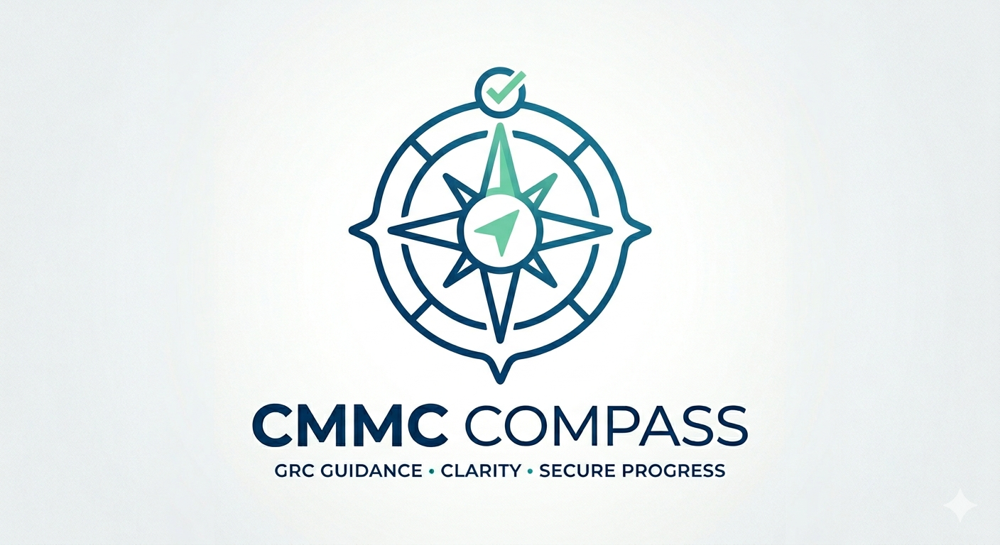
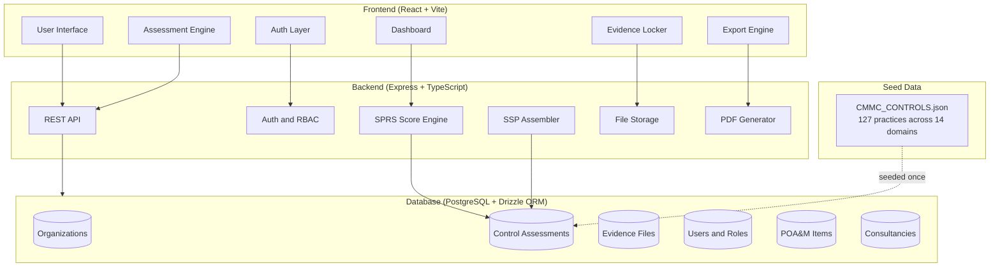
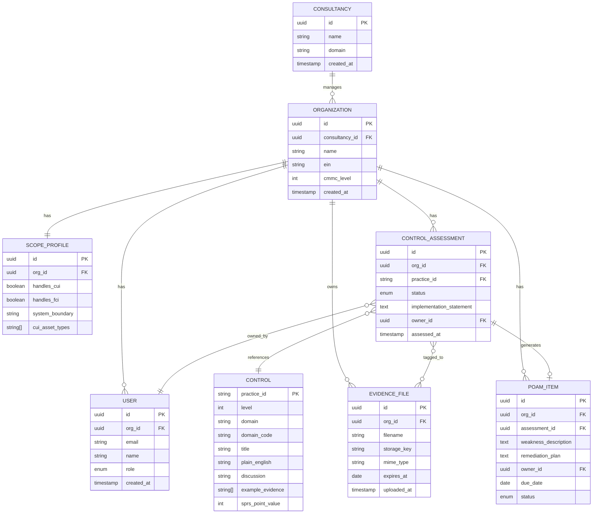
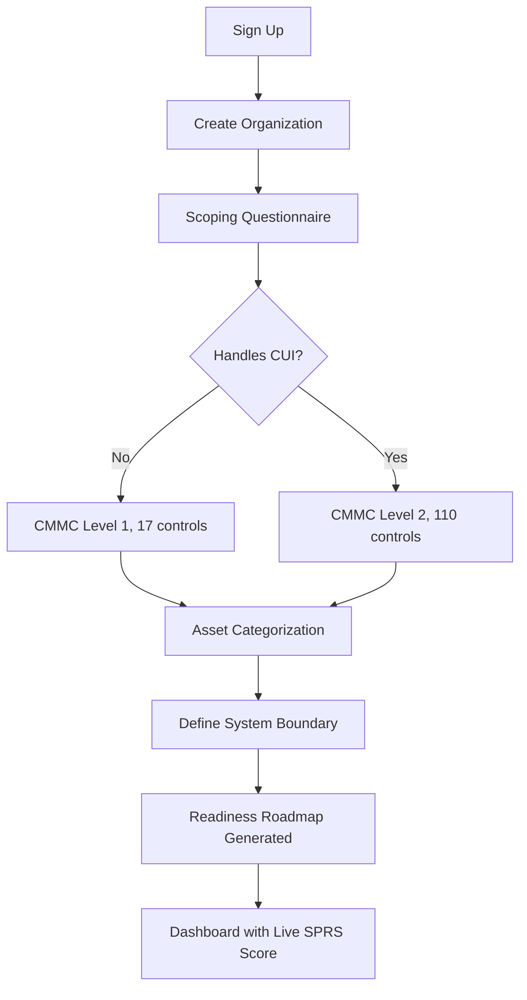
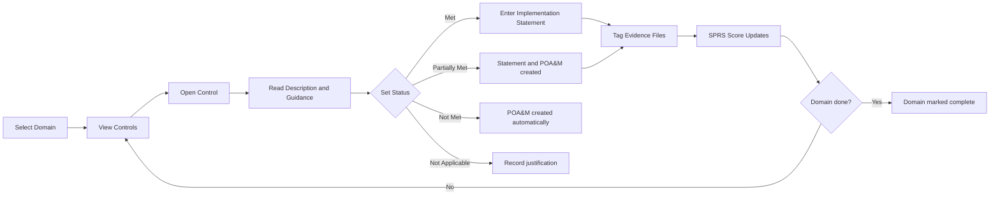
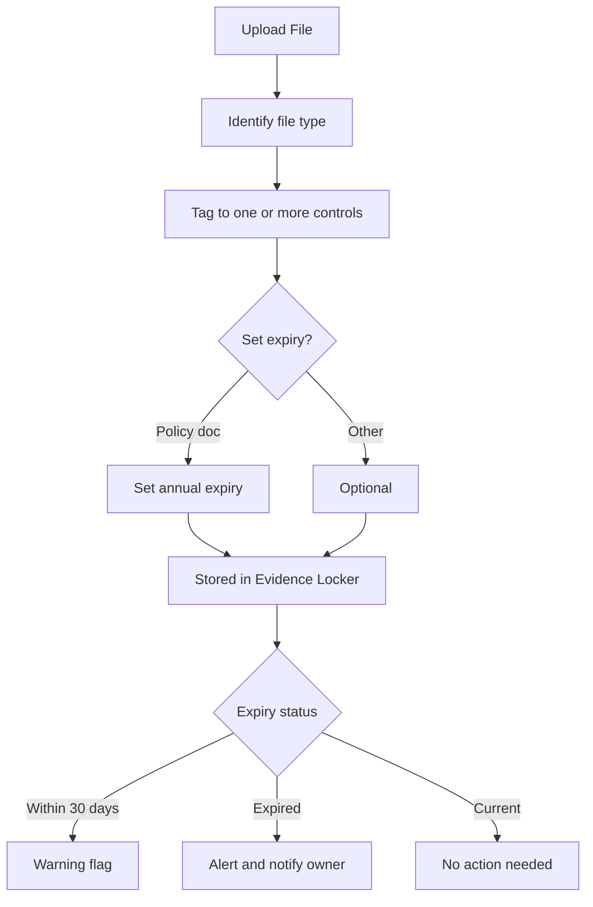
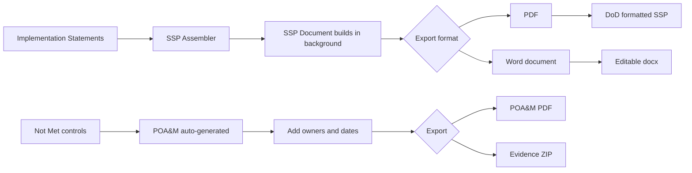
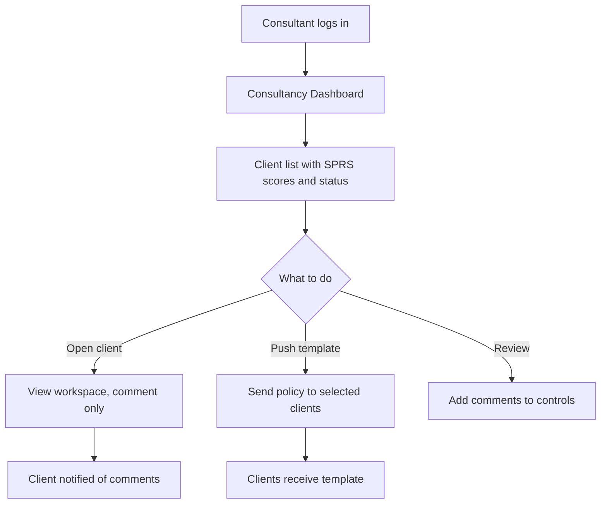

<div align="center">
  
</div>

# CMMC Compass

[](LICENSE)
[](https://www.acq.osd.mil/cmmc/)
[](CONTRIBUTING.md)
[]()

A compliance management tool for defense contractors working toward CMMC Level 1 or Level 2 certification. It guides organizations through all 14 NIST SP 800-171 domains, tracks the SPRS score in real time, manages evidence, and generates the SSP and POA&M documents required for assessment.

The tool also supports consultancies and MSPs that manage compliance across multiple client organizations.

---

## Table of Contents

- [Overview](#overview)
- [Who It Is For](#who-it-is-for)
- [Features](#features)
- [Architecture](#architecture)
- [Data Model](#data-model)
- [User Flows](#user-flows)
- [CMMC Framework Coverage](#cmmc-framework-coverage)
- [Tech Stack](#tech-stack)
- [Project Structure](#project-structure)
- [Roadmap](#roadmap)
- [Getting Started](#getting-started)
- [Contributing](#contributing)
- [License](#license)

---

## Overview

CMMC 2.0 requires defense contractors to prove they have implemented up to 110 security controls before and during DoD contract performance. The process involves scoping the assessment environment, completing a System Security Plan, collecting evidence for each control, remediating gaps through a Plan of Action and Milestones, and submitting a scored SPRS score to the DoD database.

Most organizations find this process difficult to manage with spreadsheets and shared drives. CMMC Compass keeps everything in one place: the control assessment, the evidence, the score, and the documents.

---

## Who It Is For

| Track | User | What they do in the tool |
|---|---|---|
| Track 1 | Defense Contractor | Self-assessment, evidence management, SSP and POA&M generation |
| Track 3 | Consultancy or MSP | Manage multiple client organizations, push policy templates, view aggregate status |

Track 2 (C3PAO assessor tooling) is planned for a later phase.

---

## Features

### Track 1: Contractor Platform

**Scoping**

A guided questionnaire that determines whether the organization needs Level 1 (FCI only, 17 controls) or Level 2 (CUI present, 110 controls). It walks through asset categorization and captures the system boundary used in the SSP.

**Control Assessment**

All 14 domains are presented one at a time. Each control shows a plain-English description, the NIST assessment guidance, and example evidence types. Users mark each control as Met, Partially Met, Not Met, or Not Applicable, and enter an implementation statement that feeds directly into the SSP.

**SPRS Score**

The score updates in real time as controls are assessed. It starts at 110 and deducts points for each unimplemented control. The dashboard shows score by domain and highlights which controls would recover the most points.

**Evidence Management**

Files are uploaded once and can be mapped to multiple controls. A single Access Control Policy document, for example, might satisfy requirements across ten different controls. Files track an expiry date and get flagged before they lapse.

**POA&M Tracker**

Any control marked Not Met or Partially Met automatically creates a POA&M entry. Users assign an owner, set a due date, and track remediation through to completion.

**SSP and Export**

The System Security Plan assembles automatically as implementation statements are filled in. When ready, users export a formatted PDF following DoD and NARA templates. The POA&M exports in OMB format. Evidence can be exported as a structured ZIP package.

**Assessor View**

A toggle that switches the interface to show what a C3PAO assessor would see: control ID, implementation statement, tagged evidence, and responsible owner. Useful for reviewing readiness before a formal assessment.

### Track 3: Consultancy Layer

Consultants see an aggregate dashboard showing SPRS scores, overdue POA&M items, and evidence gaps across all client organizations. Policy templates can be created once and pushed to individual clients or all clients at once. Clients and consultants communicate through threaded comments on individual controls.

Access is role-based. Consultants default to read-only access within client workspaces until elevated.

---

## Architecture



---

## Data Model



---

## User Flows

### Onboarding and Scoping



### Control Assessment



### Evidence Management



### SSP and POA&M Export



### Consultancy View



---

## CMMC Framework Coverage

| Domain | Code | Level 1 | Level 2 | Total |
|---|---|---|---|---|
| Access Control | AC | 2 | 22 | 24 |
| Awareness and Training | AT | 0 | 3 | 3 |
| Audit and Accountability | AU | 0 | 9 | 9 |
| Configuration Management | CM | 0 | 9 | 9 |
| Identification and Authentication | IA | 2 | 11 | 13 |
| Incident Response | IR | 0 | 3 | 3 |
| Maintenance | MA | 0 | 6 | 6 |
| Media Protection | MP | 1 | 8 | 9 |
| Personnel Security | PS | 0 | 2 | 2 |
| Physical Protection | PE | 4 | 6 | 10 |
| Risk Assessment | RA | 0 | 3 | 3 |
| Security Assessment | CA | 0 | 4 | 4 |
| System and Communications Protection | SC | 2 | 14 | 16 |
| System and Information Integrity | SI | 4 | 7 | 11 |
| **Total** | | **17** | **110** | **127** |

Source: CMMC 2.0 Model, NIST SP 800-171 Rev 2.

---

## Tech Stack

| Layer | Technology |
|---|---|
| Frontend | React 18 + Vite |
| UI | shadcn/ui + Tailwind CSS |
| Backend | Express 5 + TypeScript |
| Database | PostgreSQL with Drizzle ORM |
| Auth | Role-based sessions |
| File Storage | Object storage |
| PDF Export | Server-side generation |
| API Contract | OpenAPI 3.0 with codegen |
| Package Manager | pnpm workspaces |

---

## Project Structure

```
cmmc-compass/
├── assets/
│   └── logo.png
├── artifacts/
│   ├── api-server/          # Express backend
│   └── web/                 # React frontend
├── lib/
│   ├── api-spec/            # OpenAPI spec
│   ├── api-client/          # Generated React Query hooks
│   ├── api-zod/             # Generated Zod schemas
│   └── db/                  # Drizzle ORM schema
├── data/
│   └── CMMC_CONTROLS.json   # All 127 control definitions
├── docs/
│   ├── architecture.md
│   ├── data-model.md
│   ├── cmmc-framework.md
│   └── roadmap.md
├── scripts/
├── .github/
│   ├── ISSUE_TEMPLATE/
│   └── PULL_REQUEST_TEMPLATE.md
├── CONTRIBUTING.md
└── LICENSE
```

---

## Roadmap

### Phase 1: Contractor Platform
- [ ] Auth, organization setup, team invitations
- [ ] Scoping questionnaire with Level 1 / Level 2 selection
- [ ] Domain-by-domain control assessment
- [ ] Live SPRS score dashboard
- [ ] Evidence locker with multi-control tagging and expiry tracking
- [ ] POA&M tracker with owner assignment and due dates

### Phase 2: Document Export
- [ ] SSP export as PDF and Word
- [ ] POA&M export in OMB format
- [ ] Evidence bundle export
- [ ] Assessor view toggle

### Phase 3: Consultancy Layer
- [ ] Multi-tenant architecture
- [ ] Client health dashboard
- [ ] Policy template library
- [ ] Four-role RBAC
- [ ] Threaded comment and review workflow
- [ ] Bulk actions across clients

---

## Getting Started

```bash
git clone https://github.com/saisravan909/cmmc-compass.git
cd cmmc-compass
pnpm install
cp .env.example .env
# Edit .env with your database URL and session secret
pnpm --filter @workspace/db run push
pnpm --filter @workspace/api-server run dev
pnpm --filter @workspace/web run dev
```

Full setup instructions will be added to [docs/architecture.md](docs/architecture.md) as the application is built.

---

## Contributing

Read [CONTRIBUTING.md](CONTRIBUTING.md) before opening a pull request.

---

## License

MIT - Sai Sravan Cherukuri
